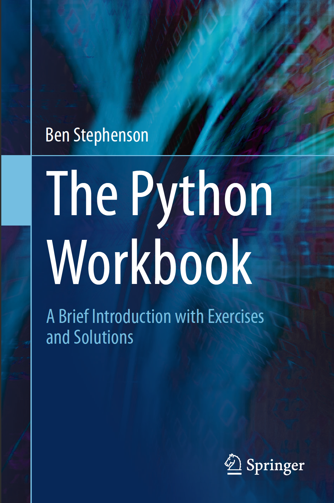

# The Python Workbook: A Brief Introduction with Exercises and Solutions
## Seek solutions but not the answers...

Self written answers for The Python Workbook: A Brief Introduction with Exercises and Solutions.  
*Only use sparingly for code pattern reference as some code are either written in non PEP 8 standard, or could be written better.*  
Also note that I went for smart solutions over tedious.  
  


## If you haven't for some odd reason, have Python 3 installed you can:
### For Mac Users:
` brew cask install anaconda`
  OR
`brew install python`

### For Windows Users:
Download: https://www.python.org/downloads/windows/
OR
Download: https://www.anaconda.com/products/individual#windows

### For Linux:
```
sudo apt-get update
sudo apt-get python3.7
```
  
 _Note: I personally recommend Anaconda due to the ability to create virtual environments easily._
 _Note 2: Python 3.6 and 3.7 has support for most libraries, be prepared to not have as many working libraries in Python 3.8 which is very new in comparison._

## Now that you're ready, [let's begin!](https://github.com/Derpythederp/The-Python-Workbook/tree/master/Exercise_book)

```python
print("Hello World!")
```
